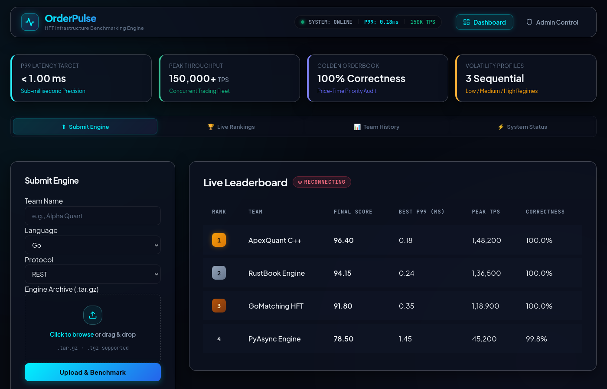
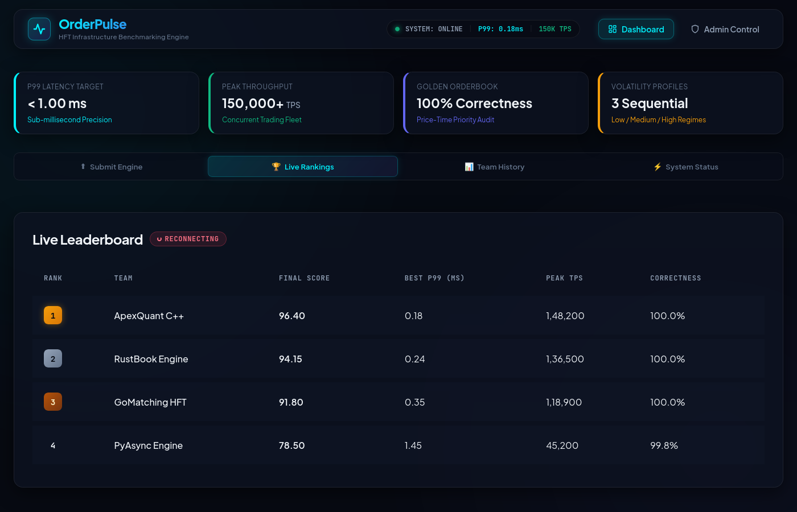
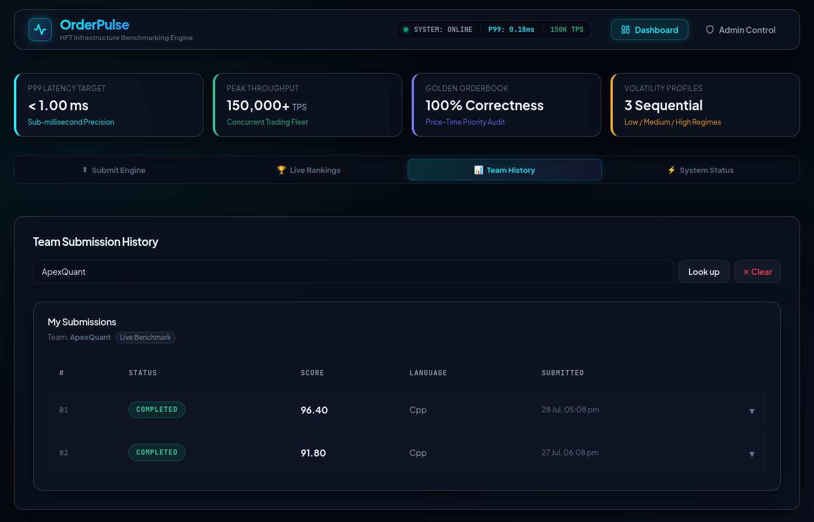
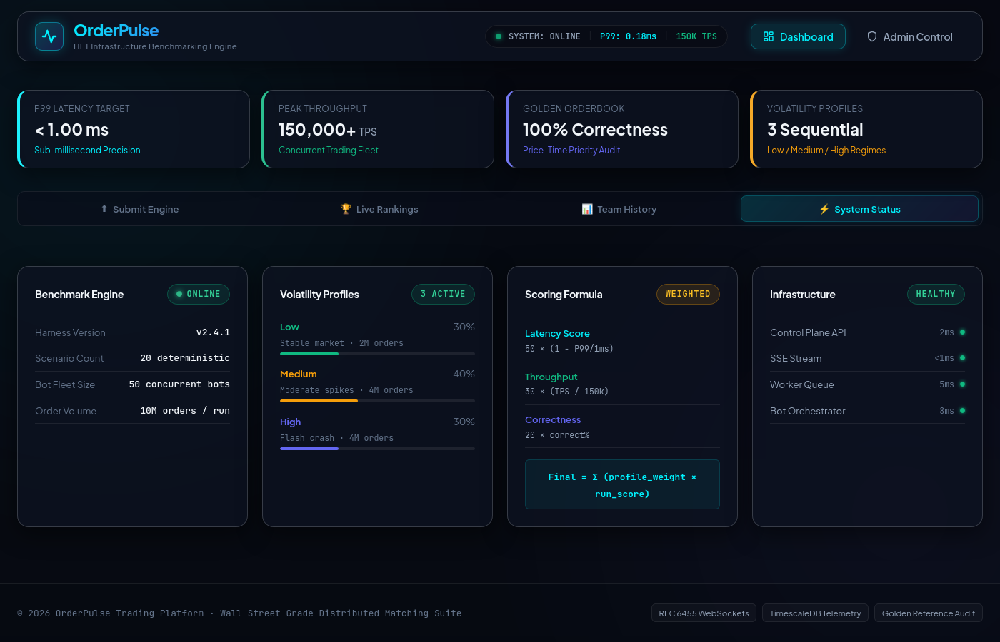

# OrderPulse
### A distributed benchmarking platform for high-frequency trading infrastructure

OrderPulse takes an untrusted CLOB (Central Limit Order Book) matching engine, sandboxes it in an isolated container, bombards it with thousands of synthetic trading bots across three volatility regimes, measures p50/p90/p99 latency and throughput, verifies price-time priority correctness against a golden reference orderbook, and streams a live ranked leaderboard to all connected clients in real time.

It is a Wall Street-grade stress-testing pipeline with an interactive benchmark suite built to evaluate matching engine correctness and performance under load.

<p align="center">
  
  <br>
  <em>1. Engine Submission view featuring Wall Street Performance Ribbon and Drag-and-Drop Dropzone</em>
</p>

<p align="center">
  
  <br>
  <em>2. Live Rankings Leaderboard featuring real-time team rankings, P99 latency, TPS, and correctness audits</em>
</p>

<p align="center">
  
  <br>
  <em>3. Team Submission History view with per-run benchmark breakdowns and status indicators</em>
</p>

<p align="center">
  
  <br>
  <em>4. Infrastructure System Status & Telemetry panel displaying volatility profiles, scoring formulas, and microservice health</em>
</p>

---

## What Problem Does This Solve?
Evaluating trading infrastructure is hard. You cannot tell if a matching engine is correct just by running simple unit tests — you need to know whether it maintained price-time priority under heavy concurrent load, whether it correctly handled partial fills, and whether it degraded gracefully or catastrophically at 50,000+ orders per second.

OrderPulse answers all three questions simultaneously, at scale, for multiple engine instances in parallel, with a live streaming leaderboard.

---

## Core Features & Architecture Highlights

- **Combined Performance & Correctness Scoring:** Speed without correctness is zeroed out. Correctness acts as a quadratic multiplier on latency and throughput scores.
- **Golden Reference Orderbook:** Every order sent by the bot fleet is replayed in-process against `GoldenOrderbook` to verify price-time priority fills without relying on self-reported engine metrics.
- **Pre-Flight Validator Gate:** Automatically runs a 20-scenario deterministic check before starting the bot fleet, saving compute slots on broken engines.
- **Distributed & Auto-Scaling Pipeline:** Control plane enqueues job tasks to Redpanda; horizontally scalable workers (KEDA-enabled) dequeue, sandbox, and process runs independently.
- **Three Volatility Regimes:** Tests sequentially across Low (80% limit orders), Medium (mixed), and High (1000 bots, 40% market orders) regimes.
- **Stdlib-Only WebSocket Transport:** Zero external WebSocket module dependencies, running RFC 6455 compliant persistent connections per bot.
- **Atomic File Writes:** Prevents distributed read races using `os.CreateTemp` + `Sync` + `os.Rename`.

---

## Architecture
Before diving into the codebase, please read the [Architecture Guide](docs/architecture/ARCHITECTURE.md) to understand the system design, component interactions, and project structure.
```
  Contestant / Admin Browser
         │
         ▼
  ┌──────────────────────────────────────────────────────────┐
  │  Frontend  (React + TypeScript + Vite)                   │
  │  Contestant: submit engine, track pipeline, view scores  │
  │  Admin: create contest, live leaderboard, close contest  │
  └──────────────────┬───────────────────────────────────────┘
                     │ HTTP / SSE
                     ▼
  ┌──────────────────────────────────────────────────────────┐
  │  Control Plane  (:8080)  cmd/server                      │
  │  ├─ POST /api/v1/submissions       → validates + enqueues│
  │  ├─ GET  /api/v1/leaderboard/stream→ SSE push (EventSrc) │
  │  ├─ POST /api/v1/admin/contests    → contest lifecycle   │
  │  └─ POST /api/v1/submissions/{id}/validate → manual      │
  │       probe (status=running only; worker runs pre-flight │
  │       automatically before the bot fleet)                │
  └──────────┬───────────────────────┬────────────────────────┘
             │ Enqueue               │ Broadcast
             ▼                       ▼
    ┌─────────────────┐    ┌──────────────────┐
    │  Redpanda       │    │  LeaderboardBus  │
    │  jobs.benchmark │    │  (SSE fan-out)   │
    └────────┬────────┘    └──────────────────┘
             │ Dequeue
             ▼
  ┌──────────────────────────────────────────────────────────┐
  │  Worker  cmd/worker  (scale horizontally)                │
  │  ├─ Deploy sandbox container (language-specific image)   │
  │  ├─ WaitHealthy (HTTP probe + 2s proxy warmup)           │
  │  ├─ Pre-flight gate (20-scenario validator, auto-runs)   │
  │  │    └─ FAIL → write dry_run_result, mark failed, stop  │
  │  ├─ Run BotFleet (REST or WebSocket, goroutine-per-bot)  │
  │  ├─ GoldenOrderbook → CorrectnessResult                  │
  │  ├─ Profile-aware scoring → RunScore (0.0–1.0)           │
  │  ├─ BatchEmit telemetry → Redpanda → TimescaleDB         │
  │  ├─ Append AllResults, persist via atomic file rename    │
  │  └─ Enqueue next profile job (low→medium→high)           │
  └──────────────────────────────────────────────────────────┘

  ┌──────────────────┐  ┌────────────────┐  ┌──────────────┐
  │  TimescaleDB     │  │  PostgreSQL    │  │  Grafana     │
  │  latency events  │  │  contest store │  │  dashboards  │
  └──────────────────┘  └────────────────┘  └──────────────┘
```

Every component shown here runs in Docker Compose locally and on GKE in production (Terraform-provisioned, KEDA-autoscaled).

---

## Engineering Highlights

### Go Concurrency Model

Each bot is a goroutine. A fleet of 1,000 bots runs as 1,000 concurrent goroutines, each maintaining its own HTTP or WebSocket connection to the sandbox. The fleet is coordinated with a ramp-up phase (configurable duration), a steady-state measurement window, and a clean shutdown that waits for all in-flight requests before collecting results. No global state is mutated during a run — results are collected into per-goroutine accumulators and merged after the fleet completes.

### Interface-Driven Design

Every package boundary is defined by a narrow interface:

| Interface | Defined in | Satisfied by |
|---|---|---|
| `submission.Store` | `internal/submission` | `DiskStore` (prod), `MemoryStore` (tests) |
| `worker.Executor` | `internal/worker` | `SandboxExecutor` (prod), `FakeExecutor` (tests) |
| `queue.Queue` | `internal/queue` | `RedpandaQueue` (prod), `MemoryQueue` (tests) |
| `contest.ContestStore` | `internal/contest` | `PostgresContestStore` (prod), `MemoryContestStore` (tests) |
| `worker.ContestQuerier` | `internal/worker` | `*contest.ContestService` (prod), test double (tests) |

All unit tests run against in-memory implementations — no Docker, no Kafka, no database required. The full test suite completes in under 5 seconds.

### Race-Detector Clean

`make test -race` passes across all packages. This is a hard gate on every stage — no stage is marked complete until the race detector is clean. The concurrent file I/O between the control plane (leaderboard watcher) and workers (result writers) in distributed mode is handled by atomic rename, not mutex coordination across processes.

### Telemetry Pipeline

Every order acknowledgment is emitted as a structured event (submission ID, order ID, latency nanoseconds, kind, fill status) to a Redpanda topic. A separate consumer process ingests these events into TimescaleDB hypertables partitioned by time. Grafana queries TimescaleDB directly for latency distribution charts (p50/p90/p99 over time), TPS timeseries, and correctness rate. Prometheus scrapes container CPU/memory from cAdvisor. Logs ship to Loki via Promtail.

### Scoring Model

```
RunScore(profile) = CorrectnessScore × (LatencyWeight × normP99 + ThroughputWeight × normTPS)
                  + CorrectnessWeight × CorrectnessScore

FinalScore = (LowWeight × RunScore(low)
            + MediumWeight × RunScore(medium)
            + HighWeight × RunScore(high)) × 100
```

Correctness acts as a multiplier on the latency and throughput terms — an engine that processes orders at sub-millisecond P99 but returns wrong fills is penalised quadratically. The weights are contest-configurable; defaults bias toward High volatility (45%) because that is where real matching engines differentiate.

---

## Development Phases

| Phase | What Was Built | Key Technical Decisions |
|---|---|---|
| **1 — Core MVP** | Submission ingestion, language-specific sandbox images (Go/Rust/C++/Python/Binary), Docker lifecycle management, HTTP API, disk-backed store | Five separate Dockerfiles with identical entrypoint contract; `archiveExt()` handles `.tar.gz` compound extensions that `filepath.Ext` misses |
| **2 — Telemetry** | Redpanda producer in executor, consumer process, TimescaleDB hypertables, Prometheus metrics, Grafana dashboards, Loki log aggregation | Telemetry is fire-and-forget — emit failures never propagate to the benchmark result; batched to 100 events to reduce broker round-trips |
| **3 — Distributed Workers** | `queue.Queue` interface + `RedpandaQueue`, `worker.Worker` poll loop, `SandboxExecutor`, `Heartbeater`, `WorkerRegistry`, `BotFleet` with goroutine-per-bot, `GoldenOrderbook` + `Checker` | `DisableConsumer` flag on control-plane queue prevents partition stealing; idempotent guard reads current submission status before executing to handle at-least-once redelivery |
| **4 — Infrastructure** | Terraform (VPC, GKE, two node pools, Artifact Registry), Kubernetes manifests (NetworkPolicies, RBAC, PVCs, KEDA ScaledObject), GitHub Actions CI/CD | Workers autoscale on Redpanda consumer-group lag (KEDA); control-plane and worker node pools are separate to prevent resource contention |
| **5 — Advanced Benchmarking** | Contest lifecycle (draft→active→closed), three sequential volatility profiles, volatility-aware scoring, one-active-submission guard, dry-run validator (HTTP-triggered, rate-limited), SSE leaderboard bus, WebSocket bot transport, PostgreSQL contest store | WebSocket transport is stdlib-only RFC 6455 — zero new module dependencies; correctness score multiplies performance score so broken engines cannot hide behind low latency |
| **6 — Frontend** | React + TypeScript + Vite contestant and admin UIs, SSE leaderboard with exponential backoff reconnect, XHR upload with progress bar, per-profile results card, team submission history | REST seed on mount eliminates leaderboard blank on reconnect; atomic temp-file rename in `DiskStore` eliminates truncation race between control-plane and worker processes |
| **7 — Pre-flight Validator Gate** | Worker-side automatic correctness gate: 20-scenario deterministic sequence runs between `WaitHealthy` and the bot fleet; `DryRunResult` persisted on the submission; frontend `UploadForm` renders per-scenario pass/fail breakdown; `TeamHistory` expands failed submissions with enriched failure reasons | Pre-flight fires only on the `low` profile job (first in the chain) so it runs exactly once per submission; HTTP `/validate` endpoint restricted to `status=running` to prevent colliding with the live gate; worker error path reloads submission before persisting `StatusFailed` so `dry_run_result` is never overwritten |

---

## Running Locally

**Prerequisites:** Docker Desktop with Docker Compose V2, Go 1.22+, Make.

```bash
# 1. Build sandbox images (required once)
make images

# 2. Start the full stack
docker compose up --build -d

# 3. Verify all services are healthy
docker compose ps

# 4. Open the frontend
open http://localhost:5173

# 5. Open Grafana dashboards
open http://localhost:3000

# 6. Open Redpanda Console
open http://localhost:8088
```

**Admin API key:** `testkey` (set in `docker-compose.yml`).

To create a contest and start accepting submissions:

```bash
# Create and activate a contest
curl -s -X POST http://localhost:8080/api/v1/admin/contests \
  -H "Authorization: Bearer testkey" \
  -H "Content-Type: application/json" \
  -d '{"name":"Demo Contest","use_defaults":true}' | jq .id

# Activate it (replace <id> with the returned contest ID)
curl -s -X POST http://localhost:8080/api/v1/admin/contests/<id>/activate \
  -H "Authorization: Bearer testkey"
```

Then open the frontend, enter your team name, upload a `.tar.gz` containing your matching engine, and watch the pipeline run.

**Scale workers for load testing:**

```bash
docker compose up --scale worker=3 -d
```

---

## Running Tests

```bash
make test              # all unit tests, race detector enabled
make test-phase5       # Phase 5 specific tests
make smoke-phase5      # dry-run smoke test (no infrastructure needed)
make smoke-phase5-live # full live integration test (requires docker compose)
make ci                # full CI gate: lint + test + smoke + tf-validate + k8s-validate
```

All unit tests run with zero infrastructure — no Docker, no Redpanda, no database. The full suite completes in under 5 seconds.

---

## Project Structure

```
cmd/
  server/     Control plane binary (HTTP API + leaderboard watcher)
  worker/     Benchmark worker binary (dequeues jobs, runs sandboxes)
  consumer/   Telemetry consumer binary (Redpanda → TimescaleDB)

internal/
  models/       Pure domain types — Submission, BenchmarkResults, Contest, etc.
  config/       Environment variable loading, typed config struct
  api/          HTTP router, SSE bus, handler implementations
  submission/   Ingestion service, DiskStore (atomic writes), archive handling
  sandbox/      DockerManager — deploy, health-check, stop containers
  worker/       Poll loop, SandboxExecutor, Heartbeater
  queue/        Queue interface, RedpandaQueue, MemoryQueue
  botfleet/     Fleet, Bot, OrderGenerator, RESTTransport, WebSocketTransport
  correctness/  GoldenOrderbook, Checker — reference price-time priority matching
  contest/      ContestService, MemoryContestStore, PostgresContestStore
  validator/    Dry-run validator — 20-order deterministic test sequence
  telemetry/    Event types, Emitter interface, RedpandaEmitter
  orchestrator/ WorkerRegistry, heartbeat handler, fleet visibility API
  metrics/      Prometheus gauge wrappers

frontend/
  src/
    api/          Typed fetch wrappers for every backend endpoint
    components/   Leaderboard (SSE), UploadForm (XHR progress), TeamHistory
    pages/        Dashboard (contestant), Admin (supervisor)

docker/
  sandbox/      Five language-specific Dockerfiles (go, rust, cpp, python, binary)
  grafana/      Dashboard JSON + datasource provisioning
  prometheus/   Scrape config + alerting rules
  loki/         Log aggregation config
  promtail/     Docker log collection config

k8s/            Kubernetes manifests for GKE deployment
terraform/      GCP infrastructure (VPC, GKE, Artifact Registry, IAM)
scripts/        Smoke test scripts (Phase 5)
```

---

## API Reference

| Method | Path | Auth | Description |
|---|---|---|---|
| `POST` | `/api/v1/submissions` | None | Upload engine archive (multipart) |
| `GET` | `/api/v1/submissions/{id}` | None | Poll submission status + results |
| `POST` | `/api/v1/submissions/{id}/validate` | None | Manual correctness probe — only accepted when `status=running`; the worker runs this automatically before the bot fleet, so this endpoint is primarily useful for diagnostic re-checks |
| `GET` | `/api/v1/teams/{name}/submissions` | None | Team submission history |
| `GET` | `/api/v1/leaderboard` | None | Current ranked leaderboard (REST) |
| `GET` | `/api/v1/leaderboard/stream` | None | Live leaderboard (SSE) |
| `POST` | `/api/v1/admin/contests` | Bearer | Create contest |
| `POST` | `/api/v1/admin/contests/{id}/activate` | Bearer | Activate contest |
| `POST` | `/api/v1/admin/contests/{id}/close` | Bearer | Close contest + freeze leaderboard |
| `GET` | `/api/v1/admin/contests` | Bearer | List closed contests |
| `GET` | `/api/v1/admin/contests/{id}/leaderboard` | Bearer | Closed contest snapshot |
| `GET` | `/internal/workers` | None | Worker fleet health + job counts |

---

## Submission Contract

A contestant engine must:

1. Listen on `$ORDERPULSE_LISTEN_PORT` (default `7878`)
2. Respond to `GET /health` with HTTP 200 (used for liveness probing)
3. Accept `POST /orders` with JSON body:
   ```json
   { "order_id": "uuid", "kind": "limit|market|cancel", "side": "buy|sell", "price": 10000, "quantity": 5 }
   ```
4. Respond with:
   ```json
   { "order_id": "uuid", "accepted": true, "executed_price": 10000, "executed_qty": 5 }
   ```
5. Maintain strict **price-time priority**: at the same price level, the earliest-arriving order fills first
6. Be packaged as a `.tar.gz` archive containing source code (built by the sandbox) or a precompiled binary

---

## Technology Stack

| Layer | Technology | Why |
|---|---|---|
| Control plane | Go | goroutines map naturally to concurrent SSE subscribers and in-process validator runs |
| Worker / bot fleet | Go | 1,000 goroutines per fleet run, low memory overhead per goroutine |
| Message broker | Redpanda | Kafka-compatible, C++ core, lower latency than JVM Kafka, simpler ops |
| Time-series store | TimescaleDB | SQL interface on top of PostgreSQL partitioned hypertables — latency percentiles via standard window functions |
| Contest store | PostgreSQL | Transactional contest lifecycle; JSONB for VolatilityProfile avoids schema churn |
| Metrics | Prometheus + Grafana | Industry standard; Grafana embedded in admin UI via iframe |
| Logs | Loki + Promtail | Log aggregation without Elasticsearch overhead |
| Container scheduling | Kubernetes + KEDA | Worker autoscaling driven by Redpanda consumer-group lag — scales to zero when idle |
| Infrastructure | Terraform (GCP/GKE) | Reproducible, version-controlled cloud provisioning |
| Frontend | React + TypeScript + Vite | SSE via native `EventSource`, XHR for upload progress, no heavy framework needed |
| CI/CD | GitHub Actions | Build → test → validate → push image → deploy to GKE in a single workflow |

---

## Known Limitations

- **No submission cancel endpoint.** Once a submission passes the pre-flight gate and the bot fleet starts, the benchmark runs to completion across all three volatility profiles (up to 9 minutes). For engines that fail the pre-flight gate, this is not an issue — they are stopped in seconds with a full per-scenario breakdown in `dry_run_result`. For engines that pass pre-flight and then degrade under load, there is no way to abort mid-run.
- **Shared Docker socket.** Workers and the control plane share the host Docker daemon via socket mount. In production this is mitigated by running workers on a dedicated node pool with strict NetworkPolicies; a proper solution would use a container runtime API (e.g. containerd gRPC) with per-tenant namespacing.
- **DiskStore is single-host.** In the current architecture, the control plane and all workers share a Docker volume on one host. True multi-host distribution would require a network filesystem (NFS, GCS FUSE) or migrating submission metadata to PostgreSQL.
